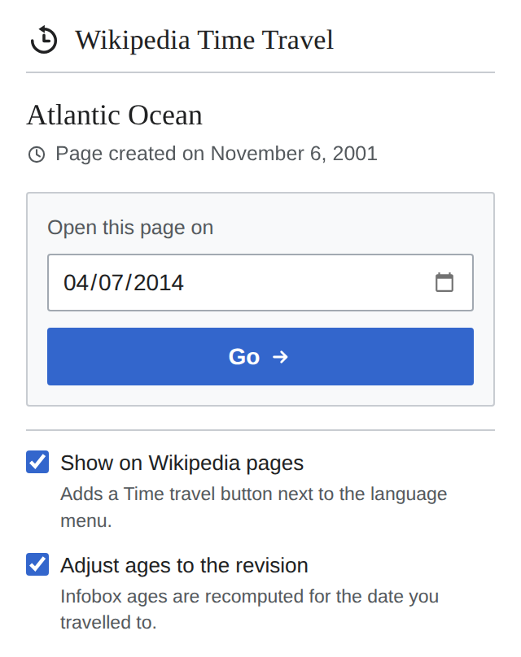
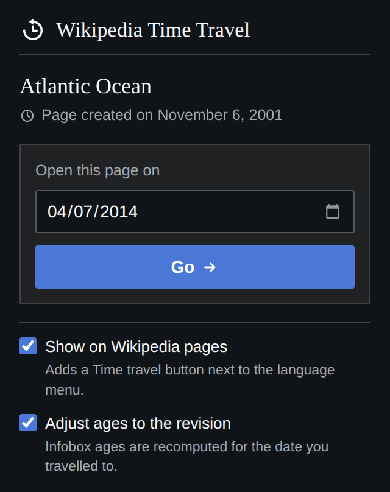
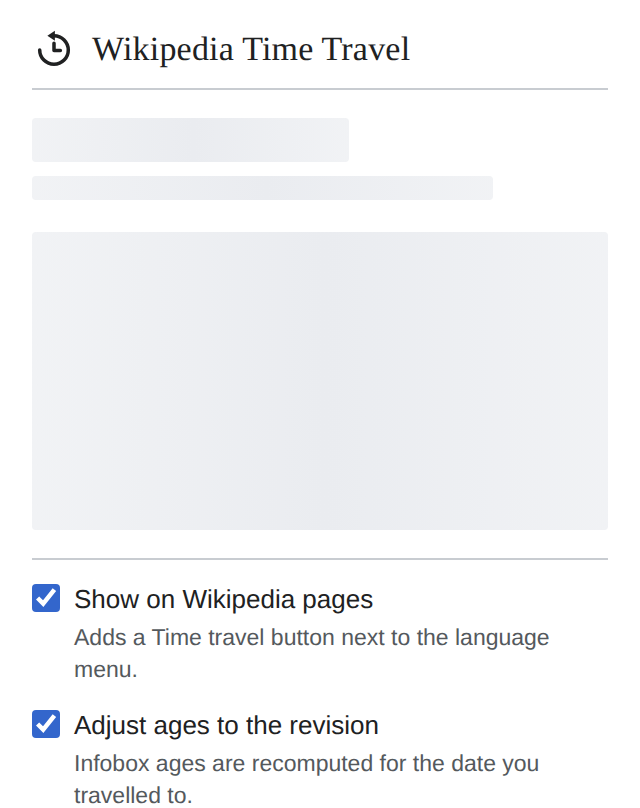
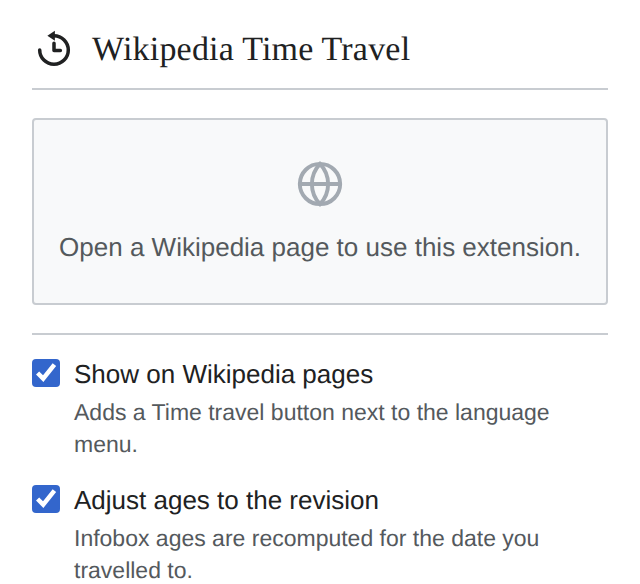

# Wikipedia Time Travel

  
   
   

Wikipedia Time Travel is a browser extension that lets you check how the text and images of Wikipedia pages have changed over time. It gets the version of a Wikipedia page that was most recent at the end of any date of your choice. Additionally, it tells you when the page was created.

## Screenshots

The popup follows Wikipedia's own visual language — a serif wordmark over a hairline rule, the
neutral grey scale and the progressive blue of the Vector 2022 skin — and follows the browser
between light and dark mode.

| Light | Dark |
| --- | --- |
|  |  |

| Loading | Not a Wikipedia page |
| --- | --- |
|  |  |

## Using it from the Wikipedia page itself

Besides the toolbar popup, the extension can add a **Time travel** button to the top of every
Wikipedia article, immediately to the left of the language selector. Clicking it opens the same
date picker without leaving the page.

This is on by default and can be turned off with the *Show on Wikipedia pages* checkbox at the
bottom of the popup. Turning it on or off takes effect straight away, without reloading the page.

## Ages on old revisions

Templates like `{{birth date and age}}` do not store an age in the wikitext - the age is worked out
when the page is rendered. An old revision is rendered today, so those ages read as the age *now*,
however far back you have travelled.

The extension recomputes them against the date of the revision you are looking at, and underlines
what it changed with a dotted line; hovering over it shows what the article itself says. This can
be turned off with the *Adjust ages to the revision* checkbox in the popup.

Only ages anchored to an [hCard](https://en.wikipedia.org/wiki/HCard) date - the hidden
`` those templates emit - are touched, so the extension never has to guess what
a bare number in an article means. In practice that covers `(age N)` from `{{birth date and age}}`
and `N years ago` from `{{start date and age}}`. Deliberately left alone:

- **Ages at death.** `(aged N)` is computed from two dates that do not move, so it is already right.
- **Imprecise dates.** `{{birth year and age}}` gives only a year, which cannot produce an exact age.
- **Everything else that is relative to now**, such as prose saying "as of this year", populations
  or standings. Those are beyond what the extension can identify.

## Installation on Google Chrome (unpacked extension)

1. Clone this repository to your local machine.
2. Open the Extension Management page by navigating to `chrome://extensions`. The Extension Management page can also be opened by clicking on the Chrome menu, hovering over `Extensions` then selecting `Manage Extensions`.
3. Enable Developer Mode by clicking the `Developer mode` toggle switch in upper right corner.
4. Click the `Load unpacked` button and select this extension's folder.
5. The extension should now be installed and ready to use in the extensions list.

## How to use

1. Navigate to any Wikipedia page.
2. Click on the extension icon in the browser toolbar, or on the `Time travel` button next to the
   language selector at the top of the page.
3. Enter the date you want to check the page for.
4. Click on the `Go` button.
5. The page will be reloaded with the version of the page that was most recent at the end of the date you entered.

## Project layout

| Path | What it holds |
| --- | --- |
| `popup/` | The toolbar popup |
| `content/` | The in-page widget and the age adjustment, injected into Wikipedia articles |
| `shared/` | MediaWiki API calls and settings storage, used by both |

## Running tests 

Pre-requisite: Install Node.js.

1. Open a terminal on the root of the project.
2. Install dependencies: `npm install`
3. Run unit tests: `npm test`
4. Run end-to-end tests: `npm run e2e` 

## Feedback and contributions

If you'd like to raise an issue, please do so in the Issues section of this repository. If you'd like to contribute, please fork this repository and submit a pull request.